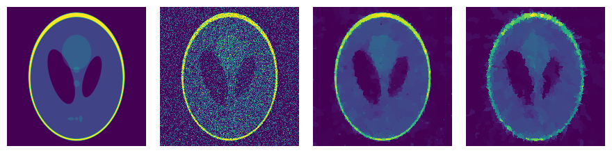

TreeLas: Fused Lasso Solvers for Trees
=======

[![Travis][travis-img]](https://travis-ci.com/EQt/treelas)
[![Build status][appveyor-img]](https://ci.appveyor.com/project/EQt/treelas)
[![License: MIT][license-img]](LICENSE.md)
      
[![Documentation: c++][docs-cxx]](https://eqt.github.io/treelas/cxx)
[![Documentation: python][docs-python]](https://eqt.github.io/treelas/python)
[![Documentation: Julia][docs-julia]](https://eqt.github.io/treelas/)


We compute the minimizer of the convex function

![formula][formula]

whereby
 * _E_ are the edges of a tree graph,
 * _λ > 0_ some edge weights,
 * _μ ≥ 0_ some node weights.


Demo: Image Denoising
-------------------


From left to right:
1. [Original Image][phantom]
2. Gaussian noise added (std=0.25)
3. _E_ is grid graph (_λ_ = 0.2)
4. _E_ is random spanning tree (_λ_ = 0.2)


Python Interface
----------------

... is realized via
[`pybind11`](https://github.com/pybind/pybind11).
For compiling, add the Git submodule
```bash
git submodule update --init --recursive deps/graphidx
```

Afterwards build the python extension by calling [`setup.py`](python/setup.py)
```bash
cd python && python setup.py develop
```


Directory Structure
-------------------

```
├── ci          Continous integration
├── cxx         C++ source/header files
├── data        Some test data and benchmarks
├── deps        External dependencies/libraries
├── julia       Julia Bindings/Implementation
├── rust        Rust re-implementation
└── python      Python bindings
```

Line Graphs
-----------

There are several implementations to be able assess e.g. different memory layouts, traversing orders, etc.

We  also provide specialized algorithms for one dimensional **line graphs** (also called “trail graphs”). 
For the sake of benchmarks the implementation by [Laurent Condat][condat] and the [`glmgen` R package][glmgen] are included as well.


[condat]: https://lcondat.github.io/
[glmgen]: https://github.com/glmgen/glmgen
[phantom]: https://en.wikipedia.org/wiki/Shepp%E2%80%93Logan_phantom
[docs-julia]: https://img.shields.io/badge/docs-julia-blue.svg
[docs-cxx]: https://img.shields.io/badge/docs-cxx-0298c3.svg
[docs-python]: https://img.shields.io/badge/docs-python-0298c3.svg
[appveyor-img]: https://ci.appveyor.com/api/projects/status/feofb7j476jagsbb?svg=true
[license-img]: https://img.shields.io/badge/license-MIT-brightgreen.svg
[travis-img]: https://app.travis-ci.com/EQt/treelas.svg?branch=main
[logo]: https://eqt.github.io/treelas/imgs/treelas.png
[formula]: https://latex.codecogs.com/svg.latex?\fn_cm&space;\large&space;\displaystyle&space;f(x)&space;=&space;\frac{1}{2}&space;\sum_{i=1}^n&space;\mu_i&space;(x_i&space;-&space;y_i)^2&space;&plus;&space;\sum_{(i,j)&space;\in&space;E}&space;\lambda_{ij}&space;|x_i&space;-&space;x_j|
